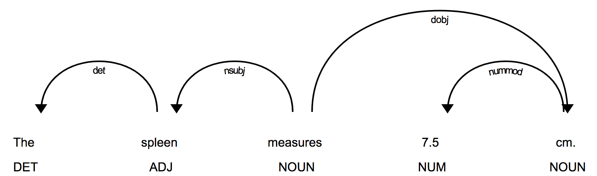
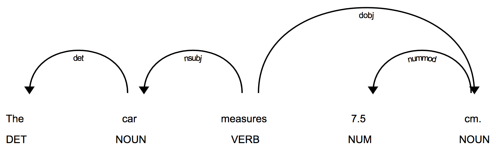
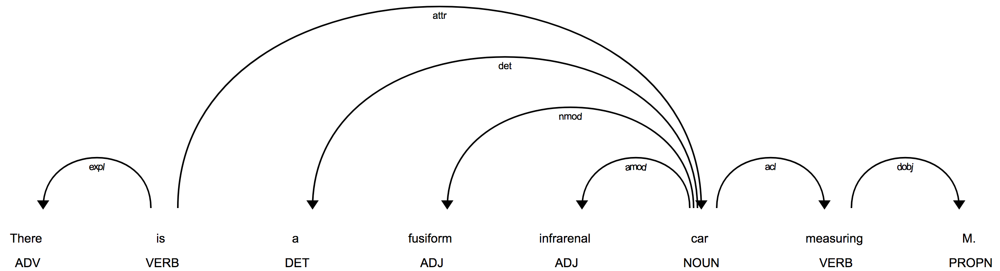

Measurement-Subject Resolution
******************************

Overview
========

Measurement-subject resolution is the process of associating size measurements
in a sentence with the object(s) possessing those measurements. For instance,
in the sentence

    ``The spleen measures 7.5 cm.``

the measurement ``7.5 cm`` is associated with ``spleen``. The term
``spleen`` is said to be the *subject* of the measurement ``7.5 cm``. In this
example the subject of the measurement also happens to be the subject of the
sentence. This is not always the case, as the next sentence illustrates:

    ``The liver is normal in architecture and echogenicity, and is``
    ``seen to contain numerous small cysts ranging in size from a few``
    ``millimeters to approximately 1.2 cm in diameter.``

Here the subject of the sentence is ``liver``, but the subject of the
``1.2 cm`` measurement is ``cysts``.

In this document we describe how Clarity analyzes sentences and attempts to
resolve subjects and measurements.

Source Code
===========

The source code for the measurement subject finder is located in
``nlp/finder/subject_finder.py``.

Inputs
------

The entry point to the subject finder is the ``run`` function:

.. code-block:: python
    :linenos:

    def run(term_string,        # string, comma-separated list of query terms
            sentence,           # string, the sentence to be processed
            nosub=False,        # set to True to disable ngram substitutions
            use_displacy=False) # set to True to display a dependency parse

The ``term_string`` argument is a comma-separated list of query terms. The
``nosub`` argument can be used to disable ngram substitution, described below.
The ``use_displacy`` argument generates an html page displaying a dependency
parse of the sentence. This visualization capability should only be used for
debugging and development.

Outputs
-------

A JSON array containing these fields for each size measurement found:

================  ==============================================================
Field Name        Explanation
================  ==============================================================
sentence          the sentence from which size measurements  were extracted
terms             comma-separated list of query terms
querySuccess      "true" if at least one query term matched a measurement subject
measurementCount  the number of size measurements found
measurements      array of individual size measurements
================  ==============================================================

Each result in the measurements array contains these fields:

================  ==============================================================
Field Name        Explanation
================  ==============================================================
text              text of the complete size measurement
start             offset of the first character in the matching text
end               offset of the final character in the matching text plus 1
temporality       indicartion of when measurement occurred
                  values are 'CURRENT' and 'PREVIOUS'
units             units of the x, y, and z fields
                  values are 'MILLIMETERS', 'SQUARE_MILLIMETERS', and
                  'CUBIC_MILLIMETERS'
condition         numeric ranges will have this field set to 'RANGE'
                  all other measurements will set this field to 'EQUAL'
matchingTerm      an array of all matching query terms for this measurement
subject           an array of strings, the possible measurement subjects
location          a string representing the anatomic location of the object
x                 numeric value of first measurement dimension
y                 numeric value of second measurement dimension
z                 numeric value of third measurement dimension
values            JSON array of all numeric values in a size list
xView             view specification for x value
yView             view specification for y value
zView             view specification for z value
minValue          minimum value of x, y, and z
maxValue          maximum value of x, y, and z
================  ==============================================================

All JSON results will have an identical number of fields. Any fields that are
not valid for a given measurement will have a value of EMPTY_FIELD and should be
ignored.

Dependencies
------------

The measurement subject finder has a dependency on Clarity's size measurement
finder module, documentation for which can be found here:
:ref:`size-measurement-finder`.

.. _spaCy: https://spacy.io/
     
There is also a dependency on `spaCy`_, a python library for natural language
processing. The spaCy library was chosen for this project because it is fast
and produces consistently good results. We will have much more to say about
spaCy below.

NGram Generator
---------------

The subject finder module has the option of peforming ngram substitutions
with medical ngrams taken from a list (``clarity_ngrams.txt``) that accompanies
the source code. This file contains ngrams spanning lengths from 1 to 14 words.
The ngrams are stored by length in the file and sorted in decreasing order of
length.

The code that generates this file is found in ``ngram_gen.py``, also in the
same folder. The ngram generator code ingests two source lists of medical terms
found in the files ``anatomic_sites.txt`` and ``medra_terms.txt``. These files
are parsed, some cleanup is performed, and the lists are sorted and written
out as ngrams to ``clarity_ngrams.txt``.

The ngrams in ``clarity_ngrams.txt`` are medical terms that are relatively
uncommon in standard English text, such as the text corpora that spaCy's
English models were trained on. By replacing uncommon domain-specific terms
with more common nouns from everyday English discourse, we have found that we
can get substantial improvement in spaCy's ability to analyze medical texts.

spaCy
-----

The Clarity subject finder module uses spaCy to generate a *dependency parse*
of each input sentence. A dependency parse provides part of speech tags
for each word as well as dependency information encoded in tree
form. To illustrate, here is a diagram of a dependency parse of the sentence
``The girl has a flower in her hair.``

.. image:: images/displacy_girl_flower.png

This image shows the part of speech tags underneath each word. In addition to
NOUN, VERB, and ADJ, we also see DET (determiner) and ADP (preposition).

The arrows represent a child-parent relationship, with the child being at the
"arrow" or "head" end and the the parent at the tail end. The word at the
child or "arrow" end modifies the word at the parent or "tail" end. Thus the
word ``The`` modifies ``girl``, since the first arrow starts at the word ``girl``
and points to the word ``The``. The label on the arrow indicates what the
parent-child relationship actually is. For the "girl-The" arrow, the ``det``
label on the arrow indicates that the word ``The`` is a determiner that
modifies ``girl``.

Continuing with the example, the subject of the verb ``has`` is the word
``girl``, as indicated by the ``nsubj`` label on the second arrow. The direct
object of the verb is the noun ``flower``, as the arrow labeled ``dobj`` shows.
The direct object has a DET modifer ``a``, similarly to the DET modifier for
the word ``girl``.

A prepositional phrase ``in her hair`` follows the direct object, as the two
arrows labeled ``prep`` and ``pobj`` indicate. The object of the preposition ``in``
is the noun ``hair``, which has a possessive adjectival modifier ``her``.

Thus a dependency parse allows one to determine the nature of the
relationships between the various components of a sentence. Clarity uses the
dependency parse information, along with a set of custom rules and heuristics
to determine the subjects of each size measurement.

Dependency Parse Errors
-----------------------

Sometimes spaCy generates an incorrect dependency parse. This happens often
in sentences that contain medical terminology, especially when medical terms
are used in different contexts than those in which they might have occurred
in the training corpora. For instance, the simple sentence

    ``The spleen measures 7.5 cm.``

generates this dependency parse:

Here we see that the verb ``measures`` was tagged as a NOUN, in the sense of
"weights and measures". The word ``spleen`` was also tagged as an adjective.
This is obviously incorrect. The problem, though, lies with the word
``spleen`` instead of ``measures``. Observe what happens if ``spleen`` is
replaced by the common noun ``car``:

This is the correct result: ``car`` is tagged as a NOUN and ``measures`` is
tagged a verb.

One can imagine the extent to which obscure medical jargon could completely
confuse spaCy. In the absence of a version of spaCy trained on medical corpora,
Clarity attempts to overcome such problems by replacing medical terms with
common English nouns. The resulting sentence **does not** have to make sense.
All it needs to do is help spaCy produce the correct dependency parse of
the sentence and correctly resolve the relationships between the various
phrases. The substitution process is not foolproof either, but we observe
consistently better results with the ngram substitutions than without them.

.. _special case tokenization rules: https://spacy.io/usage/linguistic-features#special-cases

To further help spaCy's decision processes, spaCy provides a mechanism for
introducing `special case tokenization rules`_. Clarity takes advantage of
this by introducing four special case rules for ``measure`` and related verbs.
The next code block shows how Clarity accomplishes this:

.. code-block:: python
    :linenos:

    # 'measures' is a 3rd person singular present verb
    special_case = [{ORTH: u'measures', LEMMA: u'measure', TAG: u'VBZ', POS: u'VERB'}]
    nlp.tokenizer.add_special_case(u'measures', special_case)

    # 'measure' is a non 3rd person singular present verb
    special_case = [{ORTH: u'measure', LEMMA: u'measure', TAG: u'VBP', POS: u'VERB'}]
    nlp.tokenizer.add_special_case(u'measure', special_case)

    # 'measured' is a verb, past participle
    special_case = [{ORTH: u'measured', LEMMA: u'measure', TAG: u'VBN', POS: u'VERB'}]
    nlp.tokenizer.add_special_case(u'measured', special_case)

    # 'measuring' is a verb form, either a gerund or present participle
    special_case = [{ORTH: u'measuring', LEMMA: u'measure', TAG: u'VBG', POS: u'VERB'}]
    nlp.tokenizer.add_special_case(u'measuring', special_case)

.. _Penn Treebank Notation: https://www.ling.upenn.edu/courses/Fall_2003/ling001/penn_treebank_pos.html

.. _spaCy's notation: https://spacy.io/api/annotation#pos-tagging

Here ``ORTH`` refers to orthography, or the actual text that invokes the
special case rules. ``LEMMA`` is the canonical form of the verb, identical in
all cases. The ``TAG`` entry refers to the part of speech tag using
`Penn Treebank Notation`_ for such tags. Finally, the ``POS`` entry is
`spaCy's notation`_ for the same tag.
    
These rules guarantee that the words ``measures``, ``measure``, ``measured``,
and ``measuring`` will always be tagged as verbs.

The words that Clarity substitutes for medical ngrams are:

|    ``car, city, year, news, math, hall, poet, fact,``
|    ``idea, oven, poem, dirt, tale, world, hotel``

These are all common English words that only occur as nouns.

One additional illustration can help to make this process clear. Consider this
sentence:

``There is a fusiform infrarenal abdominal aortic aneurysm measuring M.``

The dependency parse for this sentence, using the special tokenization rules,
is:

.. image:: images/displacy_fusiform_error.png

The most obvious problem here is that the word ``aneurysm``, which is a noun,
has been tagged with ``ADP``, indicating either a conjunction or preposition.
The ngram ``abdominal aortic aneurysm`` is in the Clarity ngram list, so
substituting ``car`` for ``abdominal aortic aneurysm`` results in this
sentence:

``There is a fusiform infrarenal car measuring M.``

The dependency parse for this new sentence is:

Here we see that the word ``car``, a very common word, has been correctly
tagged as a noun, leading to a correct dependency parse.  Even though
the sentence doesn't make sense, the purpose of the substitutions is to help
spaCy generate a correct dependency parse, allowing the proper relationships
among the various sentence components to be determined.

Algorithm
=========

