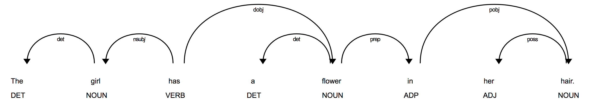
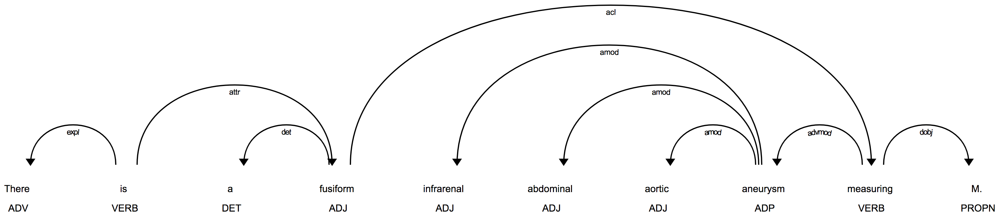

Measurement-Subject Resolution
******************************

Overview
========

Measurement-subject resolution is the process of associating size measurements
in a sentence with the object(s) possessing those measurements. For instance,
in the sentence
::
   The spleen measures 7.5 cm.

the measurement ``7.5 cm`` is associated with ``spleen``. The word
``spleen`` is said to be the *subject* of the measurement ``7.5 cm``. In this
example the subject of the measurement also happens to be the subject of the
sentence. This is not always the case, as the next sentence illustrates:
::
   The liver is normal in architecture and echogenicity, and is seen to contain
   numerous small cysts ranging in size from a few millimeters to approximately
   1.2 cm in diameter.

Here the subject of the sentence is ``liver``, but the subject of the
``1.2 cm`` measurement is ``cysts``.

In this document we describe how ClarityNLP analyzes sentences and attempts to
resolve subjects and measurements.

Source Code
===========

The source code for the measurement subject finder is located in
``nlp/algorithms/finder/subject_finder.py``.

Inputs
------

The entry point to the subject finder is the ``run`` function:

.. code-block:: python
    :linenos:

    def run(term_string,        # string, comma-separated list of query terms
            sentence,           # string, the sentence to be processed
            nosub=False,        # set to True to disable ngram substitutions
            use_displacy=False) # set to True to display a dependency parse

The ``term_string`` argument is a comma-separated list of query terms. The
``nosub`` argument can be used to disable ngram substitution, described below.
The ``use_displacy`` argument generates an html page displaying a dependency
parse of the sentence. This visualization capability should only be used for
debugging and development.

Outputs
-------

A JSON array containing these fields for each size measurement found:

================  ==============================================================
Field Name        Explanation
================  ==============================================================
sentence          the sentence from which size measurements  were extracted
terms             comma-separated list of query terms
querySuccess      "true" if at least one query term matched a measurement subject
measurementCount  the number of size measurements found
measurements      array of individual size measurements
================  ==============================================================

Each result in the measurements array contains these fields:

================  ==============================================================
Field Name        Explanation
================  ==============================================================
text              text of the complete size measurement
start             offset of the first character in the matching text
end               offset of the final character in the matching text plus 1
temporality       indicartion of when measurement occurred
                  values are 'CURRENT' and 'PREVIOUS'
units             units of the x, y, and z fields
                  values are 'MILLIMETERS', 'SQUARE_MILLIMETERS', and
                  'CUBIC_MILLIMETERS'
condition         numeric ranges will have this field set to 'RANGE'
                  all other measurements will set this field to 'EQUAL'
matchingTerm      an array of all matching query terms for this measurement
subject           an array of strings, the possible measurement subjects
location          a string representing the anatomic location of the object
x                 numeric value of first measurement dimension
y                 numeric value of second measurement dimension
z                 numeric value of third measurement dimension
values            JSON array of all numeric values in a size list
xView             view specification for x value
yView             view specification for y value
zView             view specification for z value
minValue          minimum value of x, y, and z
maxValue          maximum value of x, y, and z
================  ==============================================================

All JSON results will have an identical number of fields. Any fields that are
not valid for a given measurement will have a value of EMPTY_FIELD and should be
ignored.

Dependencies
------------

The measurement subject finder has a dependency on ClarityNLP's size measurement
finder module, whose documentation can be found here:
:ref:`measurementfinderalgo`.

.. _spaCy: https://spacy.io/
     
There is also a dependency on `spaCy`_, a python library for natural language
processing. The spaCy library was chosen for this project because it is fast
and produces consistently good results. We will have much more to say about
spaCy below.

NGram Generator
---------------

The subject finder module has the option of peforming ngram substitutions
with medical ngrams taken from a list (``clarity_ngrams.txt``) that accompanies
the source code. This file contains ngrams spanning lengths from 1 to 14 words.
The ngrams are stored by length in the file and sorted in decreasing order of
length.

The code that generates this file is found in ``ngram_gen.py``, also in the
same folder. The ngram generator code ingests two source lists of medical terms
found in the files ``anatomic_sites.txt`` and ``medra_terms.txt``. These files
are parsed, some cleanup is performed, and the lists are sorted and written
out as ngrams to ``clarity_ngrams.txt``.

The ngrams in ``clarity_ngrams.txt`` are medical terms that are relatively
uncommon in standard English text, such as the text corpora that spaCy's
English models were trained on. By replacing uncommon domain-specific terms
with more common nouns from everyday English discourse, we have found that we
can get substantial improvement in spaCy's ability to analyze medical texts.
Several examples below illustrate this substitution process.

The spaCy Dependency Parse
--------------------------

The ClarityNLP subject finder module uses spaCy to generate a *dependency parse*
of each input sentence. A dependency parse provides part of speech tags
for each word as well as dependency information encoded in tree
form. To illustrate, here is a diagram of a dependency parse of the sentence
``The girl has a flower in her hair.``

.. _displacy: https://spacy.io/usage/visualizers

.. _here: https://spacy.io/api/annotation

This diagram was generated with spaCy's display tool `displacy`_. The part of
speech tags appear underneath each word. In addition to
NOUN, VERB, and ADJ, we also see DET (determiner) and ADP (preposition).
Documentation on spaCy's annotation scheme can be found `here`_.

The arrows represent a child-parent relationship, with the child being at the
"arrow" or "head" end and the the parent at the tail end. The word at the
arrow end modifies the word at the tail end. Thus the word ``The`` modifies
``girl``, since the first arrow starts at the word ``girl`` and points to
the word ``The``. The label on the arrow indicates the nature of
the parent-child relationship. For the "girl-The" arrow, the ``det``
label on the arrow indicates that the word ``The`` is a determiner that
modifies ``girl``.

The subject of the verb ``has`` is the word ``girl``, as indicated by the
``nsubj`` (nominal subject) label on the second arrow. The direct object of
the verb is the noun ``flower``, as the arrow labeled ``dobj`` shows.
The direct object has a DET modifer ``a``, similarly to the DET modifier for
the word ``girl``.

A prepositional phrase ``in her hair`` follows the direct object, as the
two arrows labeled ``prep`` (prepositional modifier) and ``pobj``
(object of preposition) indicate. The object of the preposition
``in`` is the noun ``hair``, which has a possession modifier
``her``.

Thus a dependency parse allows one to determine the nature of the
relationships between the various components of a sentence. ClarityNLP uses the
dependency parse information, along with a set of custom rules and heuristics,
to determine the subjects of each size measurement.

Dependency Parse Errors
-----------------------

Sometimes spaCy generates an incorrect dependency parse. This happens often
in sentences that contain medical terminology, especially when medical terms
are used in different contexts from those of the training corpora.
For instance, the simple sentence
::
   The spleen measures 7.5 cm.

has this dependency parse:

.. image:: images/displacy_spleen_incorrect.png

Here we see that the verb ``measures`` was tagged as a noun, in the sense of
"weights and measures". The word ``spleen`` was also tagged as an adjective.
This is obviously incorrect. The problem, though, lies with the word
``spleen`` instead of ``measures``. Observe what happens to the dependency
parse if ``spleen`` is replaced by the common noun ``car``:

.. image:: images/displacy_car_correct.png

This is the correct result: ``car`` is tagged as a noun, ``measures`` is
tagged a verb, and the nominal subject of the sentence is ``car``.

One can imagine the extent to which obscure medical jargon could completely
confuse spaCy. In the absence of a version of spaCy trained on medical texts,
ClarityNLP attempts to overcome such problems by replacing medical ngrams with
common English nouns. The resulting sentence **does not** have to "make sense".
All it needs to do is help spaCy produce the correct dependency parse of
the sentence and correctly resolve the relationships between the various
phrases. The substitution process is not foolproof either, but we observe
consistently better results on medical texts with the ngram substitutions
than without them.

.. _special case tokenization rules: https://spacy.io/usage/linguistic-features#special-cases

To further help spaCy's decision processes, spaCy provides a mechanism for
introducing `special case tokenization rules`_. ClarityNLP takes advantage of
this by introducing four special case rules for ``measure`` and related verbs.
The next code block shows how ClarityNLP accomplishes this:

.. code-block:: python
    :linenos:

    # 'measures' is a 3rd person singular present verb
    special_case = [{ORTH: u'measures', LEMMA: u'measure', TAG: u'VBZ', POS: u'VERB'}]
    nlp.tokenizer.add_special_case(u'measures', special_case)

    # 'measure' is a non 3rd person singular present verb
    special_case = [{ORTH: u'measure', LEMMA: u'measure', TAG: u'VBP', POS: u'VERB'}]
    nlp.tokenizer.add_special_case(u'measure', special_case)

    # 'measured' is a verb, past participle
    special_case = [{ORTH: u'measured', LEMMA: u'measure', TAG: u'VBN', POS: u'VERB'}]
    nlp.tokenizer.add_special_case(u'measured', special_case)

    # 'measuring' is a verb form, either a gerund or present participle
    special_case = [{ORTH: u'measuring', LEMMA: u'measure', TAG: u'VBG', POS: u'VERB'}]
    nlp.tokenizer.add_special_case(u'measuring', special_case)

.. _Penn Treebank Notation: https://www.ling.upenn.edu/courses/Fall_2003/ling001/penn_treebank_pos.html

.. _spaCy's notation: https://spacy.io/api/annotation#pos-tagging

Here ``ORTH`` refers to orthography, the actual sequence of letters appearing
in the text. ``LEMMA`` is the canonical or "dictionary" form of the verb,
identical in all cases. The ``TAG`` entry refers to the part of speech tag using
`Penn Treebank Notation`_. The ``POS`` entry is `spaCy's notation`_
for the same part of speech tag.
    
These rules guarantee that spaCy will interpret the words ``measures``,
``measure``, ``measured``, and ``measuring`` as verbs.

The words that ClarityNLP substitutes for medical ngrams are:
::
   car, city, year, news, math, hall, poet, fact,
   idea, oven, poem, dirt, tale, world, hotel

These are all common English words that only occur as nouns.

One additional illustration can help to make this process clearer.
Consider this sentence:
::
   There is a fusiform infrarenal abdominal aortic aneurysm measuring M.

The dependency parse for this sentence, using the special tokenization rules,
is:

The most obvious problem here is that the word ``aneurysm``, which is a noun,
has been tagged with ``ADP``, indicating either a conjunction or preposition.
The adjective ``fusiform`` was also not deduced to be a modifier of ``aneurysm``.

Since the ngram ``abdominal aortic aneurysm`` is in the ClarityNLP ngram list,
substituting ``car`` for ``abdominal aortic aneurysm`` produces this
sentence:
::
   There is a fusiform infrarenal car measuring M.

The dependency parse for this new sentence is:

.. image:: images/displacy_fusiform_correct.png

Here we see that the word ``car``, a very common English word, has been
correctly tagged as a noun. The adjective ``fusiform`` now modifies car,
as it should. The ngram substitution has thus helped spaCy produce a correct
dependency parse.  Even though the sentence doesn't make sense, the purpose
of the substitutions is not to preserve the meaning of the sentence.
Substitutions help spaCy generate a **correct dependency parse**, allowing
the proper relationships among the various sentence components to be
determined.

Algorithm
=========

ClarityNLP uses several stages of processing in its attempt to resolve the
subject of each size measurement. These processing stages are:

* Sentence cleanup and ngram substitution
* Sentence template determination
* Dependency parse analysis and selection of candidate subjects
* Subject resolution and location determination
* Ngram replacement and JSON conversion

Sentence Cleanup and NGram Substitution
---------------------------------------

The cleanup stage attempts to simplify the sentence as
much as possible. A shorter sentence is more likely to be parsed correctly
than a needlessly verbose sentence. Thus ClarityNLP removes all extraneous
text from the sentence that has no bearing on the measurement-subject
resolution problem. Thse removals include:

* Removing image annotations, such as ``(image 302:33), (782b:49)``
* Removing anything in square or curly brackets, such as anonymized dates
* Removing excess verbosity, such as "for example", "in addition",
  "no evidence of", etc.
* Replacing verbose forms with less verbose forms, such as:

  * "measuring upwards of" => "measuring"
  * "is seen to contain" => "contains"
  * "is seen in" => "in"
  * etc.

* Replacing roman numerals with decimal numbers
* Replacing semicolons with whitespace (misplaced semicolons can have a
  deleterious effect on the dependency parse)
* Substituting simple nouns for medical ngrams
* Collapsing repeated whitespace into a single space
* Finding size measurements and replacing the measurement text with ``M``

This last item deserves some explanation. The sentence
::
   The spleen measures 7.5 cm.

is transformed by the measurement replacement operation to this:
::
   The spleen measures M.

The reason for the M-replacement is to facilitate the recognition of sentence
patterns in the text. We call these sentence patterns "sentence templates".
Sentences that fit a common template pattern provide clues about the sentence
structure and can be analyzed in identical ways. For instance, size
measurements in medical texts are often reported as
::
   {Something} measures {size_measurement}.

Some examples:
::
   The spleen is unremarkable measuring 8.6 cm.
   The cyst in the upper pole of the kidney measures 1.2 cm.
   The duct tapers smoothly to the head of the pancreas,
   where it measures approximately 5 mm.

After M-replacement, these sentences become:
::
   The spleen is unremarkable measuring M.
   The cyst in the upper pole of the kidney measures M.
   The duct tapers smoothly to the head of the pancreas,
   where it measures approximately M.

A regular expression designed to find a capital M preceded by a measurement
verb could easily identify all of these sentences as belonging to the same
underlying template. Custom rules for each matching sentence could be applied
to resolve the object having measurement M. ClarityNLP uses this approach for
this template and the others described below.

Sentence Template Determination
-------------------------------

ClarityNLP uses a set of sentence patterns or templates to help it resolve
measurements and their subjects. These templates were determined by examining
a large number of electronic health records and noting common forms of
expression. A set of regular expressions was developed for classifying
sentences into the various patterns. This set of regexes and sentence
patterns will likely expand as ClarityNLP evolves.

For the discussion below, it is helpful to define a few items, using a
notation similar to that for regular expressions:

===================  =======================================================
Abbreviation         Examples
===================  =======================================================
MEAS                 "measure", "measures", "measured", "measuring"
WORD                 a word or number, with optional punctuation and spaces
||                   string concatenation
\*                   zero or more of the previous item
\+                   one or more of the previous item
\*?, +?              nongreedy version of \* or \+
M                    size measurement
Q                    measurement qualifiers: "all", "approximately",
                     "currently", "mainly", etc.
DET                  determiners: "a", "an", "the"
TERMINATOR           "a", "an", or MEAS
===================  =======================================================

The templates used by ClarityNLP are:

**1. Subject Measures M**

This template, illustrated above, recognizes sentences or sentence fragments
containing an explicit measurement verb. The subject of the measurement M
is generally in the set of words preceding MEAS.

Pattern:
   
| WORD+ || MEAS || WORD* || M

**2. DET Words M**

This template recognizes sentences or sentence fragments that omit an
explicit measurement verb. For instance:

| "An unchanged 2cm hyperechoic focus..."
| "...and has a simple 1.2 x 2.9 x 2.9 cm cyst..."

Greedy and nongreedy patterns:

| DET || WORD+ || Q* || M || WORD+
| DET || WORD+ || Q* || M || WORD+? || TERMINATOR
   
**3. DET M Words**

Same as #2, but with the words in a different order. Examples:

| "A 3cm node in the right low paratracheal station..."
| "The approximately 1 cm cyst in the upper pole of the left kidney..."

Greedy and nongreedy patterns:

| DET || Q* || M || WORD+
| DET || Q* || M || WORD+? || TERMINATOR

**4. Ranging in Size**
 
The phrase "ranging in size" occurs frequently in diagnostic medical reports.
ClarityNLP substitutes the verb "measuring" for
"ranging in size" and then applies the *Subject Measures M* template to
the sentence. An example:

"Distended gallbladder with multiple stones ranging in size from a few millimeters to 1 cm in diameter."

**5. Now vs. Then**

This template recognizes sentences comparing measurements taken on
different dates. For instance:

| "The lesion currently measures 1.3 cm and previously measured 1.2 cm."
| "A left adrenal nodule measures 1.2 cm as compared to 1.0 cm previously."

ClarityNLP uses a set of seven regexes in its attempts to find such sentences.
The first regex is used to match the first measurement of the pair, and the
others are used to match the second measurement.

**6. Before and After**

This template recognizes sentences and sentence fragments with measurement
subjects occurring before and after each measurement. For example:

"The left kidney measures 8.5 cm and contains an 8 mm x 8 mm anechoic
rounded focus along the lateral edge, which is most likely a simple
renal cyst."

Pattern:

| DET || WORDS+ | MEAS || Q* || M || WORD* || DET || M || WORDS+
   
ClarityNLP searches for measurement subjects in each WORDS+ group captured by the
associated regex.

**7. M and M**

This template recognizes sentences comparing two similar objects, two
views of an object, or an object and features inside it.  For instance:

"The lower trachea measures 14 x 8 mm on expiratory imaging and 16 x 17 mm on inspiratory imaging."

"The largest porta hepatis lymph node measures 1.6 cm in short axis and 2.6 cm in long axis."

Pattern 1:

| WORD* || MEAS || Q* || M || WORD* || and || WORD*

Pattern 2:

| WORD+ || MEAS || Q* || M || WORD* || and || WORD+ || to || Q* || M || WORD+

**8. Carina**

This is a special case template for sentences involving endotracheal tubes
and distances relative to the carina. An example sentence:

"Endotracheal tube is in standard position about 5 cm above the carina."

Template Matching
^^^^^^^^^^^^^^^^^

ClarityNLP counts the number of M's in the sentence after the cleanup phase and
attempts template matching on fragments containing either one or two M's.
Sentences or fragments matching a template are sent to the next stage of
processing, dependency parse analysis, described below. If no templates match,
ClarityNLP attempts a dependency parse analysis without having the benefit of
knowing the sentence structure via a template match. ClarityNLP will attempt
measurement-subject resolution on sentences containing as many as three
measurements.

Dependency Parse Analysis
-------------------------

After the template matching phase completes, ClarityNLP uses spaCy to generate
a dependency parse of the sentence or fragment that matched the template.
ClarityNLP uses the dependency parse information and a set of custom rules to
navigate the parse tree looking for the measurement subject. This is typically
the noun modified by the measurement itself. For simple sentences this noun is
relatively easy to find, since it is often the subject of the sentence. For
more complex sentences, ClarityNLP must navigate the (sometimes incorrect) parse
tree using a set of heuristics, custom rules, and corrective actions in an
attempt to find the subject. The actual algorithm itself is complex and
involves handling of many specal cases, many of which were developed to
correct errors in the parse tree. The full algorithm can be found in the
function ``get_meas_subject`` in the file ``nlp/finder/subject_finder.py``.

Finding the Starting Token
^^^^^^^^^^^^^^^^^^^^^^^^^^

ClarityNLP begins its examination of the parse tree by searching for the token
with text "M" (which has replaced the measurement(s)). If this token is not
its own parent, meaning that it is a child node of another token, Clarity
starts its processing with the parent of the M node. If the M node *is* its
own parent, ClarityNLP looks for the verb token nearest the M token as its
starting point. If a verb cannot be found, ClarityNLP looks for a dependency of
``nsubj`` or ``compound`` and takes whichever it can find. If none of these
can be found, ClarityNLP gives up on finding a starting token and returns an
empty subject.

Navigating the Parse Tree
^^^^^^^^^^^^^^^^^^^^^^^^^

After finding a starting token, ClarityNLP then begins to navigate the parse
tree, searching for a measurement subject. Both the part of speech tag
and the dependency relationship contribute to ClarityNLP's decision at each node.

The first determination ClarityNLP makes is whether it has arrived at the root
node or not. If it happens to be at the root node, it can go no further in
the tree, so it looks for a measurement subject (noun) amongst the children
of the root node, if any.

If a verb is encountered when navigating the parse tree, a check is made on
the dependency for the verb token. If it is "nsubj", meaning the nominal
subject of the sentence, experimentation suggests that the part of speech
tag was probably incorrectly set to VERB instead of NOUN. The token is saved
and used as a candidate subject. If the verb is a measurement verb, the parent
token is selected as a candidate subject.

If a noun is encountered, ClarityNLP's decision depends on the dependency label
for the token. Some dependency relationships are ignorable, which means that
the parent node linked to a child with an ignorable dependency cannot be the
measurement subject. These ignorable dependency relationships are:

=========== ==========================
Dependency  Meaning
=========== ==========================
acomp       adjectival complement
attr        attribute
conj        conjunct
dobj        direct object
pcomp       complement of preposition
pobj        object of preposition
prep        preposition
=========== ==========================

Any noun token linked to its parent via an ignorable dependency is skipped, and
ClarityNLP moves up one level in the tree to the parent node.

ClarityNLP applies several other empirically determined rules for handling special
cases, such as when it encounters the preposition "with".  Normally
prepositions are ignored during tree navigation by continuing on to their
parent node. The word "with" deserves special handling, because sometimes it
is used as a conjunction to link two clauses that could have been independent
sentences. To illustrate, consider these sentences:

"There is extensive, pronounced cervical lymphadenopathy throughout levels II
through IV, **with** lymph nodes measuring up to 2 cm."

"...as well as a more confluent plaque-like mass **with** a broad
base along the tentorial surface measuring approximately 2 cm in greatest
dimension."

In the first example, the preposition "with" separates two independent
clauses and is used as a conjuction. The subject of the 2 cm measurement is
"lymph nodes", which happens to be the object of the preposition "with".
In this case the objects of the preposition "with" cannot be ignored.

In the second example, the preposition "with" has an object that can be
ignored. The subject of the 2 cm measurement, "mass", is not part of the
prepositional phrase associated with the word "with".

ClarityNLP is not always able to resolve these two usages of "with" in all
instances. So whenever it encounters the preposition "with", it saves the
object of that preposition as a candidate measurement subject and continues
navigating the tree.

Subject Resolution and Location Determination
^^^^^^^^^^^^^^^^^^^^^^^^^^^^^^^^^^^^^^^^^^^^^

The preceding phase of processing results in a list of candidate subjects.
If the list is empty, ClarityNLP was unable to find a subject. If the list
is nonempty, any duplicates are removed. If only one subject remains it
is chosen as the subject.

If multiple candidate subjects remain, the noun chunks obtained from spaCy's
analysis of the sentence helps to select the best candidate. The chunks
containing each candidate subject are found, and the distance (in words) from
the measurement verb (if any) and the associated measurement are computed.
ClarityNLP then chooses the candidate that is either within the same noun chunk as
the measurement, or which is the closest candidate to that particular chunk.

ClarityNLP also attempts to find the anatomical location for each measurement
subject. To do so, it uses information from the template match to identify
the most likely sentence fragment that could contain the location. A set of
location-finding regexes then attempts to match the fragment and identify
the location. Various special-case rules are applied to any matches found,
to remove any matches that happen to not actually be locations, and to remove
extraneous words. Any remaining text then becomes the location for the
measurement.

If location matching fails for all sentence fragments, or if the sentence
failed to match a template altogether, ClarityNLP makes one final attempt to
determine a location on the sentence as a whole, using the location-finding
regexes and the process described above.

Ngram replacement and JSON conversion
^^^^^^^^^^^^^^^^^^^^^^^^^^^^^^^^^^^^^

The final stage of processing adds additional modifiers to the chosen subject.
ClarityNLP performs a recursive depth-first search through the parse tree to
capture all modifiers of the subject, any modifiers of the modifiers, etc.
A depth-first search is needed to keep the modifiers in the proper word order
as they are discovered.

After all modifiers of the subject have been found, the ngram substitution
process is reversed, restoring the original words of the sentence. The
list of measurements, along with their subjects and locations, is converted
to JSON and returned as the result.

