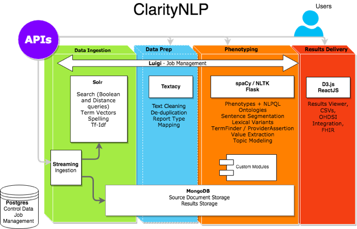

Developer Guide
===============
This library uses Python 3.5+. The source code is hosted `here <https://github.com/ClarityNLP/ClarityNLP>`_.

Here's an overview of ClarityNLP's architecture.

Reference Documentation
-----------------------
.. toctree::
   :maxdepth: 2

   apis/index

Technical Background
--------------------
.. toctree::
   :maxdepth: 2

   technical_background/technologies
   technical_background/solr
   technical_background/pipelines
   testing
   local-nlp-setup

Utility Algorithms
------------------

.. toctree::
   :maxdepth: 1

   algorithms/section_tagger
   algorithms/context
   algorithms/lexical_variants
   algorithms/sentence_tokenization

Task Algorithms
---------------

.. toctree::
   :maxdepth: 1

   algorithms/term-finder
   algorithms/size_measurement_finder
   algorithms/tnm_stage_finder
   algorithms/value_extraction
   algorithms/measurement_subject_resolution

Building Custom Task Algorithms
-------------------------------

.. toctree::
   :maxdepth: 1

   custom/custom

