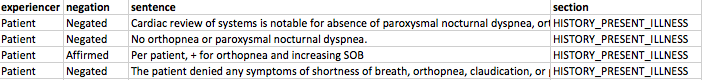
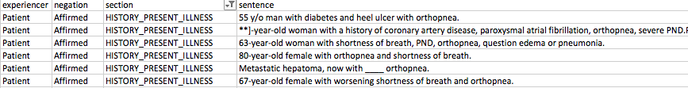
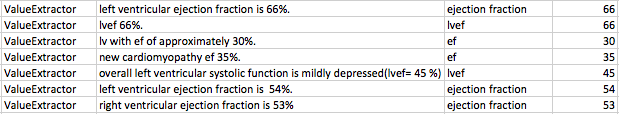

# Overview
Before going through these examples, make sure to review the [NLPQL walkthrough](../intro/overview.html "simple walkthrough") to get an understanding of the general components of NLPQL.  For this set of examples, we will be focusing on extracting data relevant to congestive heart failure.

Note we recommend prepending each query with `limit 100;` which keeps the job small and allows you to test queries without taking up a lot of time and compute resources. Once you have developed a query and want to scale it to the full dataset, simply remove the `limit` statement.

**All of the sample results shown here are from the de-identified [MIMIC III](https://mimic.physionet.org/) dataset.**

# Example 1: Finding Symptoms of a Disease
In this first example, we are looking for certain symptoms of congestive heart failure likely to be found only in the clinical notes.  Specifically we are looking for orthopnea and paroxysmal nocturnal dyspnea (PND).

## Using TermFinder
```java
limit 100;

//phenotype name
phenotype "Orthopnea" version "2";

//include Clarity main NLP libraries
include ClarityCore version "1.0" called Clarity;

termset Orthopnea:
  ["orthopnea","orthopnoea","PND"];

define hasOrthopnea:
  Clarity.TermFinder({
    termset:[Orthopnea]
    });
```
Here we have simply defined a set of terms we are interested and lumped them into a `termset` called *Orthopnea*.  We could have named this termset anything.

The `TermFinder` function simply takes in that list of terms and finds all documents with these terms, without any additional filtering.  Here are example results.



As you can see, while the TermFinder was helpful in finding mentions of our Orthopnea terms, much of what was found were actually negative mentions (ie, the patient did _not_ have the symptom).  So ClarityNLP lets you set a variety of constraints around TermFinder, for example limiting results to particular sections of the note or just to affirmed mentions.


```java
define hasOrthopnea:
  Clarity.TermFinder({
    termset:[Orthopnea],
    negated:"Affirmed",
    sections:["CHIEF_COMPLAINT","HISTORY_PRESENT_ILLNESS"]
    });
```
But because in most situations we need to find positive mentions that are current and relevant to the patient, ClarityNLP has a convenient function called `ProviderAssertion` that allows you to bypass entering all the typical parameters.  Here is a simple example.  

## Using ProviderAssertion

```java
limit 100;
//phenotype name
phenotype "Orthopnea" version "2";

//include Clarity main NLP libraries
include ClarityCore version "1.0" called Clarity;

termset Orthopnea:
  ["orthopnea","orthopnoea","PND"];

define hasOrthopnea:
  Clarity.ProviderAssertion({
    termset:[Orthopnea]
    });
```

As you can see, the results are now limited to just positive mentions.



# Example 2: Extracting Quantitative Values
In this example, we will be searching for ejection fraction values using a very simple algorithm.  Specifically, we will be looking for certain terms and subsequent values that would be typical for EF values.  There are many more sophisticated methods to find ejection fraction (e.g [Kim et al](https://www.ncbi.nlm.nih.gov/pubmed/28163196)).  Our goal in this example is to provide you familiarity with the use of the ClarityNLP `ValueExtraction` functionality.

```java
limit 100;
//phenotype name
phenotype "Ejection Fraction Values" version "1";

//include Clarity main NLP libraries
include ClarityCore version "1.0" called Clarity;

termset EjectionFractionTerms:
  ["ef","ejection fraction","lvef"];

define EjectionFraction:
  Clarity.ValueExtraction({
    termset:[EjectionFractionTerms],
    minimum_value: "10",
    maximum_value: "85"
    });
```


If you wanted to find only low ejection fractions, you could do this in two ways.  The first is by modifying the min and max parameters.  For example:

```java
define EjectionFraction:
  Clarity.ValueExtraction({
    termset:[EjectionFractionTerms],
    maximum_value: "30"
    });
```
This will filter your results to only those <30%.

# Example 3: Extracting Non-Quantitative Values
In some cases you may want to extract data points that are values but not numeric.  A good example is CHF class.  Below is an example of NLPQL to pull out NYHA classifications.

```java
limit 100;
//phenotype name
phenotype "NYHA Class" version "1";

//include Clarity  main NLP libraries
include ClarityCore version "1.0" called Clarity;

termset NYHATerms:
  ["nyha"];

define NYHAClass:
  Clarity.ValueExtraction({
    termset:[NYHATerms],
    enum_list: ["3","4","iii","iv"];
    });
```

### Looking up more stuff


Note: we recommend prepending each query with `limit 100;` which keeps the job small and allows you to test queries without taking up a lot of time and compute resources. Once you have developed a query and want to scale it to the full dataset, simply remove the `limit` statement.
