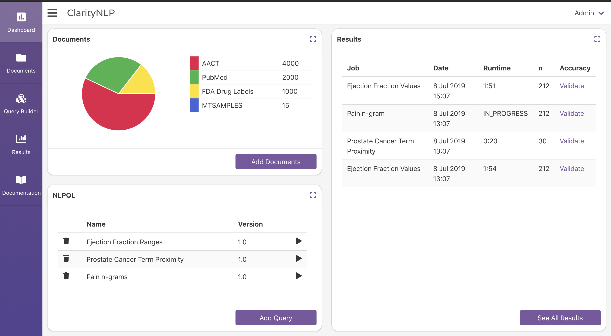
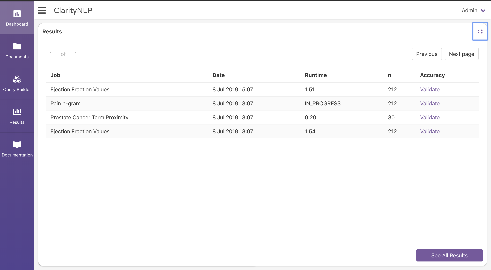
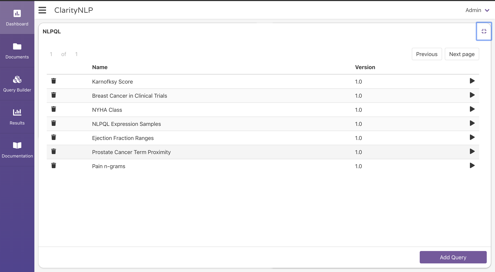

.. _ui_dashboard:

.. _Query Builder: ./query_builder.html
.. _Results Viewer: ./results_viewer.html

Dashboard
=============

The Dashboard is designed to give you a summary of your ClarityNLP instance at a glance.
The Dashboard shows you the following:

* The document types (and number of each type) stored in your Solr instance
* The NLPQL queries you have created and saved via the `Query Builder`_
* The name, date, runtime, cohort size, and validation status of your NLPQL jobs

--------

To view all of your documents, results, or NLPQL queries, simply click on the expand
button at the top right of the corresponding box.
This action expands the box to full screen and provides more information on the given field.
To return to the default view, click on the collapse button located at the top right corner.

.. image:: ./images/claritynlp_dashboard_2.png

Additional Features
--------

If you would like to quickly navigate to the results of one your recent jobs,
you can click on that job's row in the results table to go directly to the results
in the `Results Viewer`_.

Alternatively, if you would like to open the NLPQL file of a previously saved query,
click on the respective row in the NLPQL table to open that query in the `Query Builder`_.

You can run saved queries by pressing the play button (right-pointing arrowhead)
in the same row as the query.

You can delete a saved query by pressing the trash can icon next to the name of the query.

