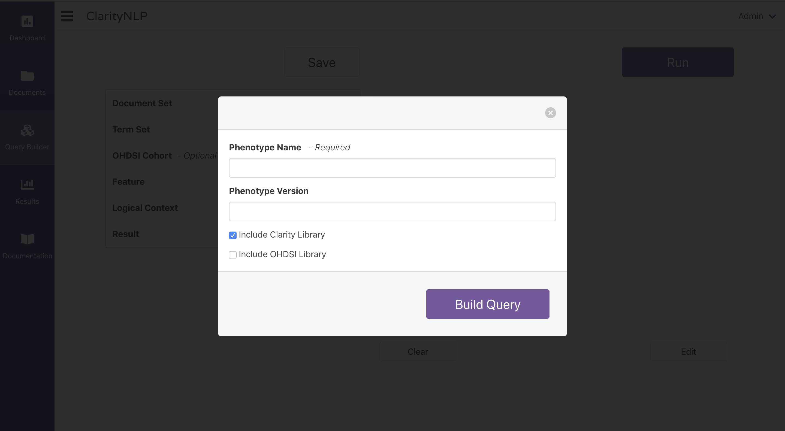
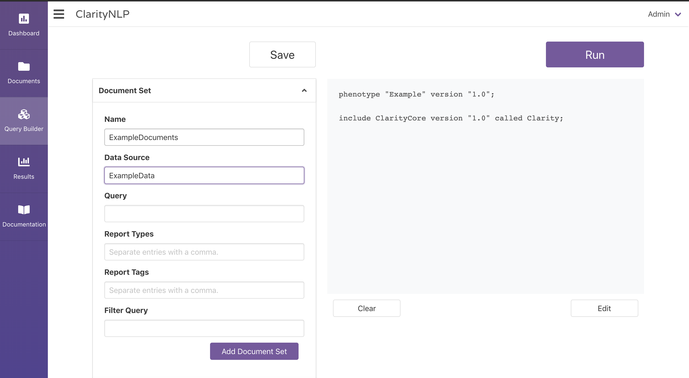
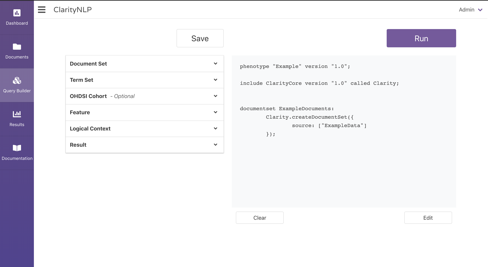
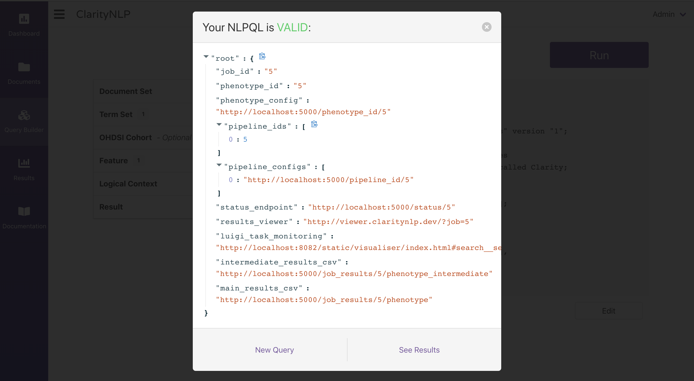
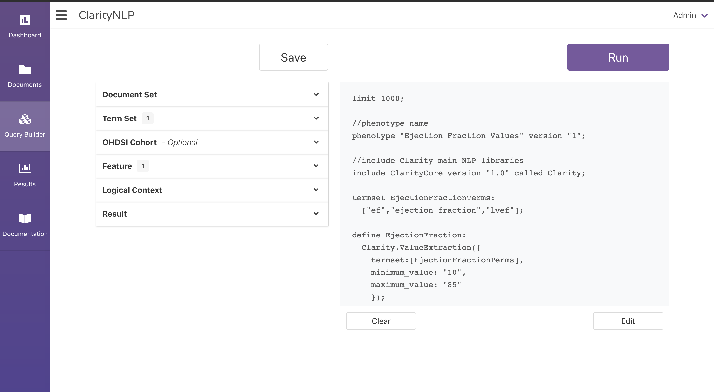

.. _ui_query_builder:

.. _Dashboard: ./dashboard.html
.. _NLPQL Reference: ../index.html#how-to-write-a-query

Query Builder
=============

The Query Builder is a tool to assist in the development of NLPQL queries.

When you open the Query Builder, it will prompt you to enter a name and version number for your NLPQL query.

NOTE: a previously-saved query cannot be overwritten. Each query must be saved with a unique version number.

After you have named and versioned your query, you can begin building your query.

.. image:: ./images/claritynlp_builder_2.png

To add a component to the query, simply click on the component you would like to add,
fill out the fields that you need, and click the corresponding add button.

After you finish building your query, you can click the save button just above the
dropdowns to save your query indefinitely. You can also run the query by clicking the
run button at the top right. 

You can specify a limit to the number of documents processed by using an NLPQL ``limit`` statement.
The form in the next image allows you to specify a limit:

.. image:: ./images/claritynlp_builder_5.png

If your NLPQL query passes the validity checks, you will be shown some metadata about your query:

NOTE: If at any point you want to delete your query you can click the clear button at
the bottom of the text area to start over.

Loading a Query
-------------

If you navigated here from a link or from the `Dashboard`_, your query will automatically
load into the text area.

You can edit this query by clicking the edit button below the text area.

To learn more about NLPQL, please see the `NLPQL Reference`_.
