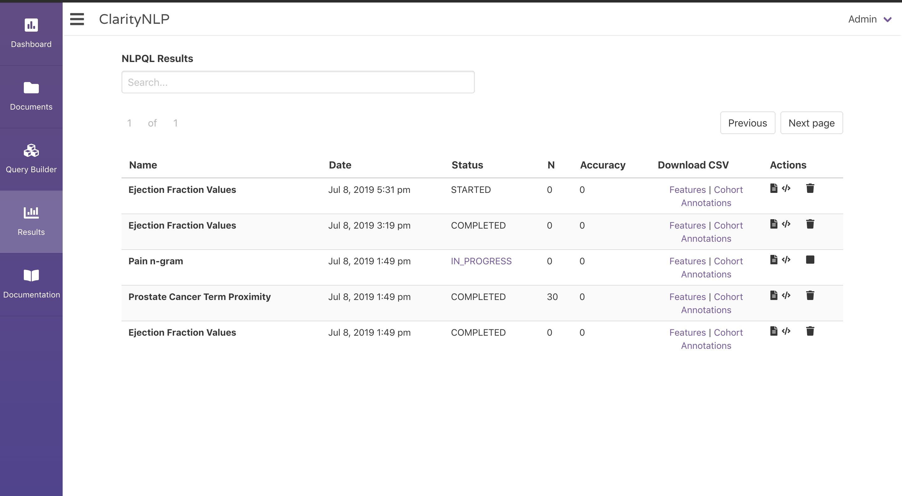
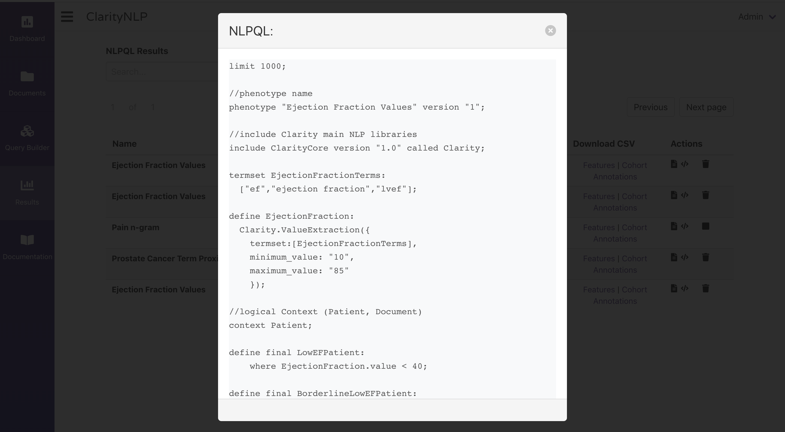
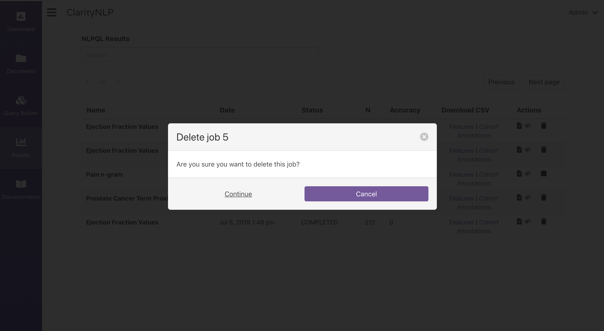
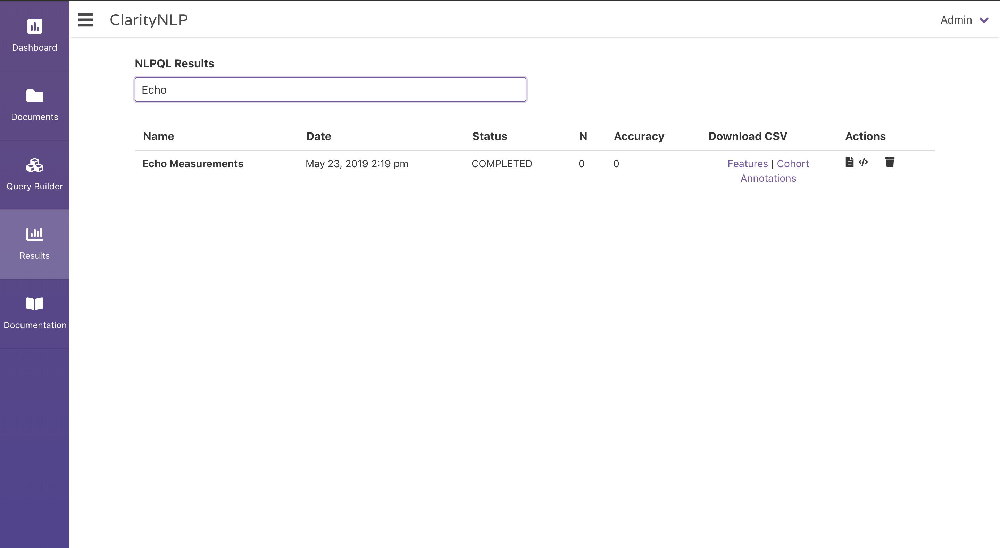
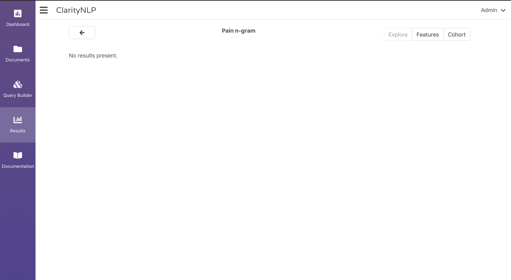
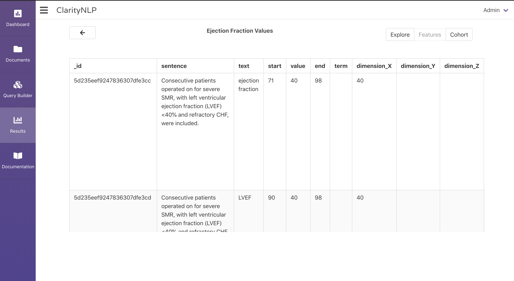
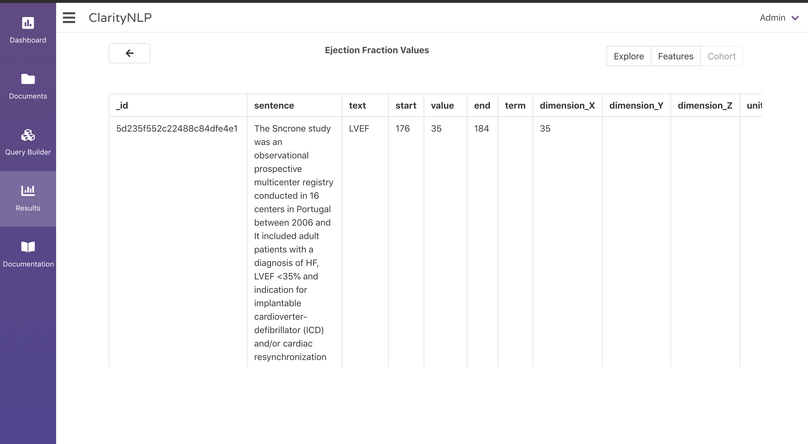
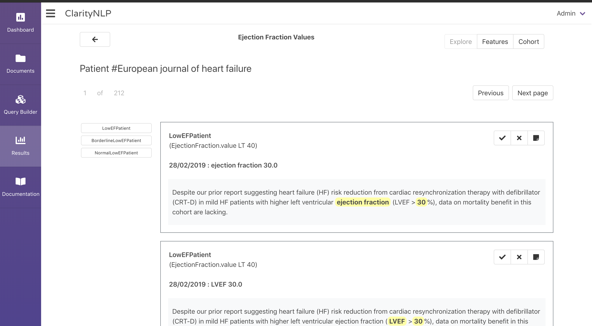
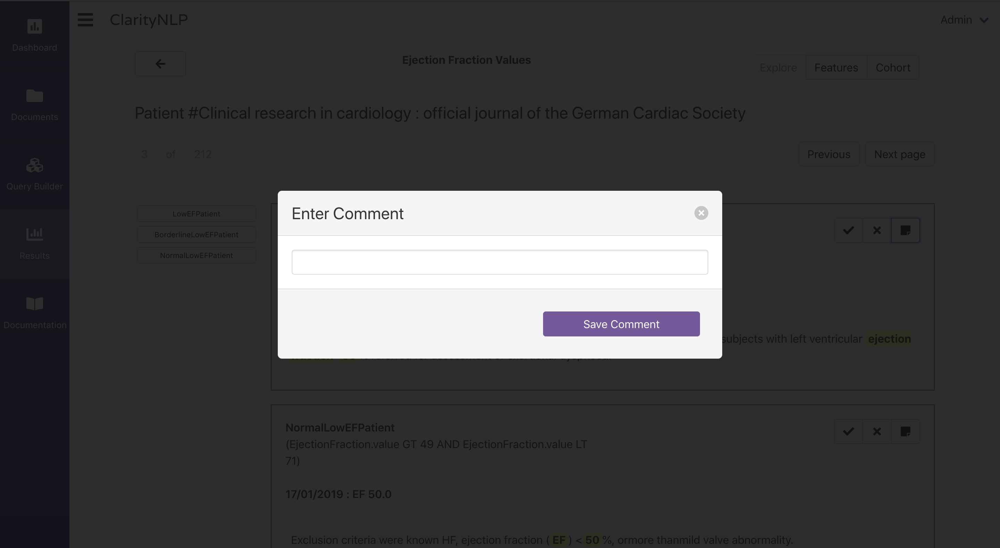
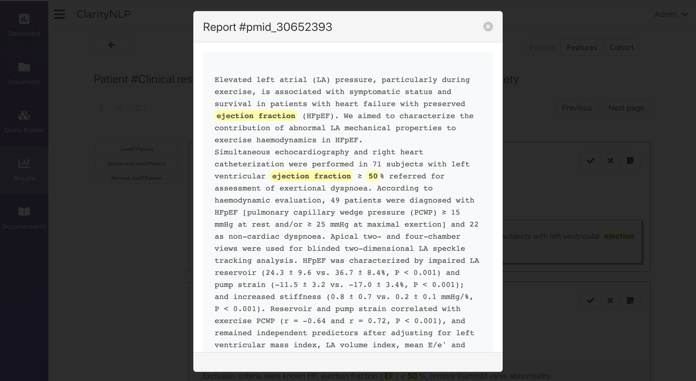

.. _ui_results_viewer:

Results Viewer
==============

The Results viewer is designed to give you a comprehensive look at the results from a ClarityNLP run.

The first screen provides a list of the 20 most recently-submitted jobs.
You can navigate the results by using the "Next page" and "Previous" buttons at the top right of the list.
Each job has many interactions associated with it, which are:

- The name of the query
- The query submission date
- The current status of the job.
  If the job is not finished, the job status appears as a hyperlink that takes
  you to the Luigi task viewer for that job.
- The cohort size for that particular query
- The accuracy score from an evaluation of the results
- Download links for the job that includes CSVs of:
    - Results
    - Cohort
    - Annotations
- Actions that can be taken for the job, which include:
    - Viewing the text representation of the query
    - Viewing the JSON representation of the query
    - Deleting the job

NOTE: Job deletion is permanent and cannot be undone.

.. image:: ./images/claritynlp_viewer_4.png

This list is also searchable via terms entered into the text box above the list:

To delve deeper into the results for a job, click on that job's row in the list.
This brings you to a screen where you can see individual results from the query.
You can also see the number of events that were recognized for each result.

.. image:: ./images/claritynlp_viewer_2.png

If no results were found for a query, a blank screen will appear.

At the top right of the page, you can cycle through the "Explore", "Feature", and "Cohort" views.
The Feature and Cohort views appear as scrollable tables. The Explore view is the default.

If you want to view the results for a patient, click that patient's row in the list.
This will bring you to a screen where you can see highlighted results.

The "Next Page" and "Previous" buttons to the top right will cycle you through the various patients for that job. 

At the left side of the page is a list of the NLPQL features for which results were found.
Clicking one of these features will show the results for that feature only.
All results are displayed by default.

.. image:: ./images/claritynlp_viewer_9.png

Each result box shows the name of the relevant NLPQL feature, the definition
of that feature immediately below it, and an extract from a source document.
The extract highlights relevant terms and values associated with the feature.
           
In the upper right corner of each result box is a set of buttons that can be
used to evaluate ClarityNLP's results. You can:

- Click the checkmark if the result is correct
- Click the X if the result is incorrect
- Click the notepad to enter a comment about the result

You can click on the sentence to view the complete source document:

